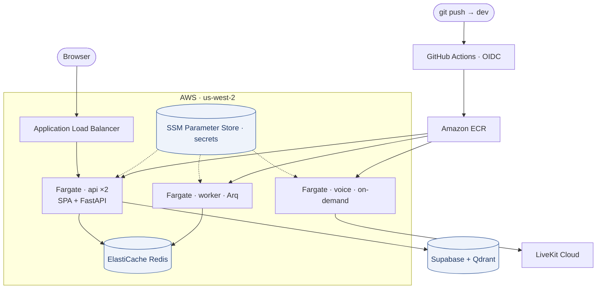
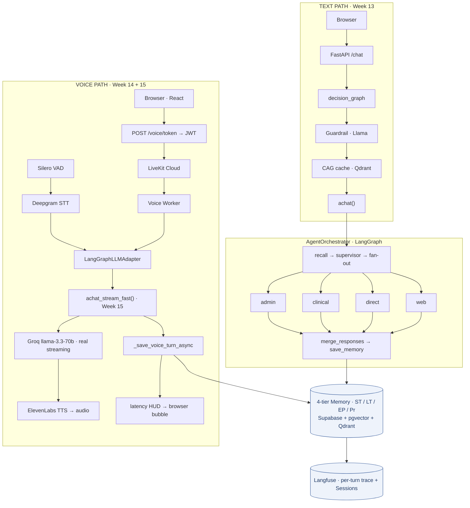
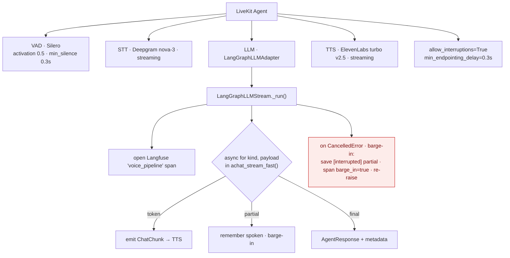
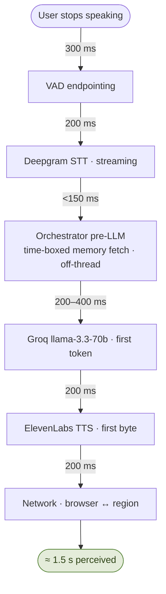
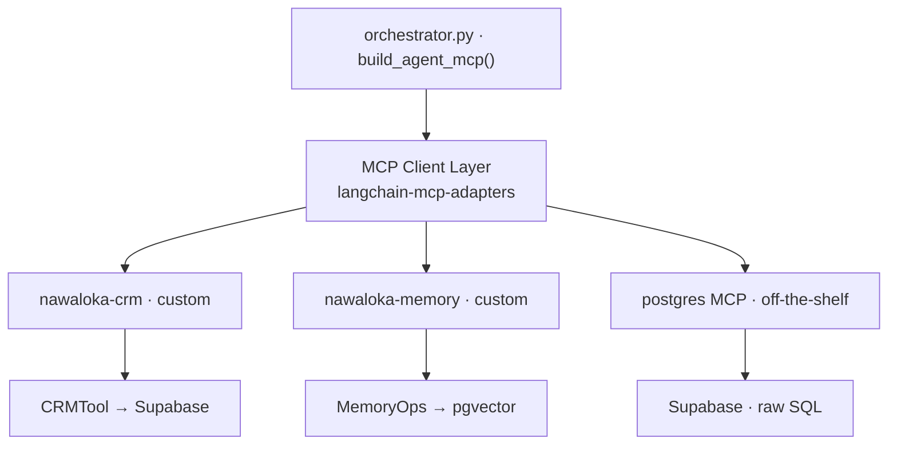
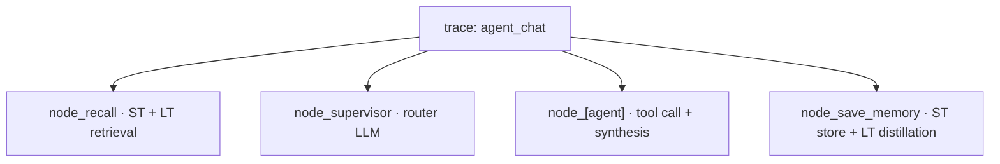
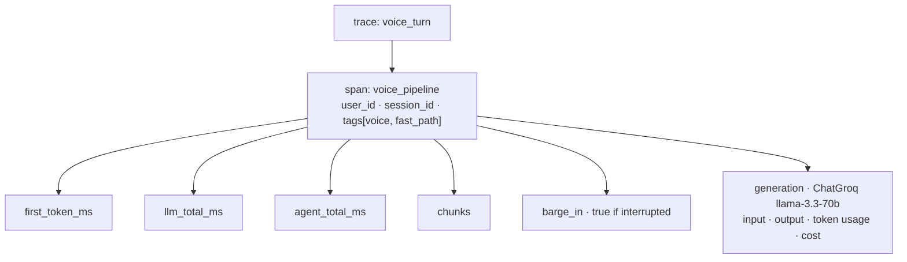
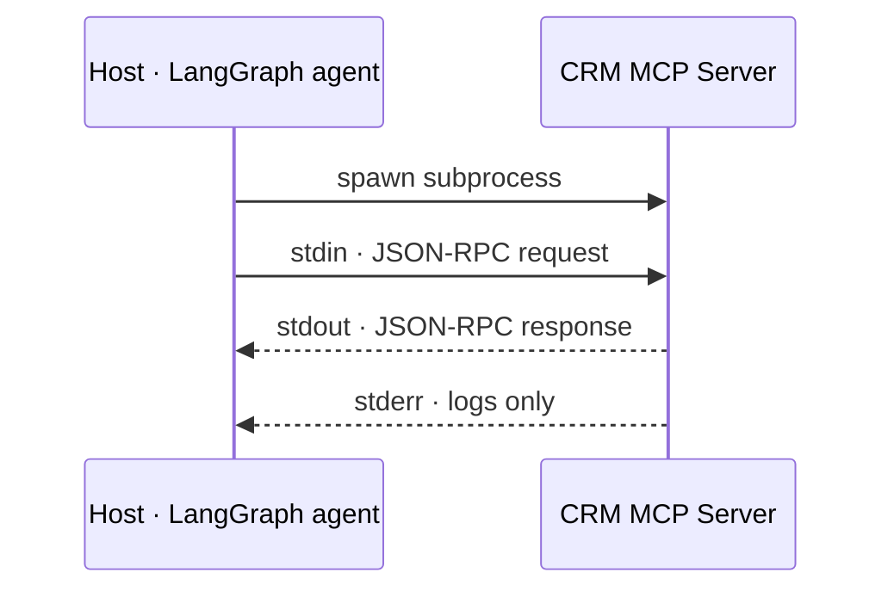

# Multi-Agentic Voice AI — Nawaloka Hospital

> **Production-shaped voice assistant** — LiveKit + Deepgram STT + ElevenLabs TTS + Groq llama-3.3-70b sit on top of a LangGraph multi-agent system with a 4-tier memory, MCP-backed CRM, RAG knowledge base, real-time web search, Langfuse observability, and a reactive React UI.

[](https://www.python.org/downloads/)
[](https://langchain-ai.github.io/langgraph/)
[](https://modelcontextprotocol.io/)
[](https://fastapi.tiangolo.com/)
[](https://docs.livekit.io/agents/)
[](https://deepgram.com/)
[](https://elevenlabs.io/)
[](https://groq.com/)
[](https://langfuse.com/)

---

## What's new in Week 15

This week the voice path moved from *"works in LiveKit's playground"* to *"first-class feature in the actual app"* — with a measured sub-2-second latency budget, integrity-preserving memory on barge-in, and full-stack observability.

| Feature | Impact |
|---|---|
| **Voice fast path** (`achat_stream_fast`) | Bypasses the multi-agent graph for voice — single streaming LLM call. Drops perceived latency from ~32 s → ~1.5 s. |
| **Real token streaming** (`streaming=True` on the fast LLM) | First-token latency 2247 ms → 379 ms. Real streaming, not client-side chunking. |
| **Memory + barge-in integrity** | If the user interrupts mid-sentence, the *partial* answer (what was actually spoken) is saved to memory tagged `[interrupted]`. Long-term distillation skips interrupted turns. The agent's recollection matches the user's experience. |
| **Reactive UI bubble** (`VoiceBubble.tsx` + `VoiceRoom.tsx`) | WebAudio-driven SVG that pulses with mic + agent audio. Five states: idle / listening / thinking / speaking / error. Latency HUD beneath. |
| **LiveKit token endpoint** (`/voice/token`) | Browser-callable JWT minter so the UI joins LiveKit rooms without exposing the API secret. |
| **Sidebar split — Voice / Chat** | The session list now has two halves: voice calls on top, text chats below. Client-side partition by `voice-` prefix on `session_id`. |
| **Auto-generated session titles** | After 4 turns, a fast Groq LLM summarises the conversation into a 3–6 word title. Replaces `"Conversation 2026-05-17 12:30"` with something like `"Cardiology Appointment Booking"`. Costs ~$0.00001 per session. |
| **Latency observability triangle** | Per-turn timings visible in **three places**: worker log, Langfuse `voice_pipeline` span with metadata, browser HUD via LiveKit data channel. |
| **Tuned VAD endpointing** | `silence_threshold_ms`: 500 → 300, `min_endpointing_delay`: 0.5 → 0.3. 400 ms saved per turn. Yaml + dataclass defaults now in sync. |
| **Worker pre-warming** (`warm_start`) | One tiny `llm_fast.ainvoke("hi")` at boot primes the HTTPS pool so call #1 doesn't pay TLS handshake cost. |
| **Langfuse v3+/v2 import fallback** | Tracing works whether your env has langfuse v2 or v4. |

Each item above is labelled with the file it touches; see the **Architecture** and **Voice pipeline internals** sections below for how they fit together.

---

## What's new in Week 16 — Deploy to AWS + CI/CD

Week 16 takes the local production stack to the cloud and makes deployment hands-off.

| Feature | Impact |
|---|---|
| **AWS Copilot → ECS Fargate** | Three services (`api`, `worker`, `voice`) on serverless Graviton/arm64 containers behind an Application Load Balancer. No servers to manage. |
| **ElastiCache Redis + Arq worker** | Managed Redis as the broker; the Arq worker drains slow jobs (memory distillation, auto-titling) off the request path. |
| **SPA served from the API** | The React UI is built into the `api` image and served at `/`; FastAPI strips the `/api` prefix so one ALB hostname serves both the app and the API — no CORS, no second host. |
| **SSM Parameter Store secrets** | 21 secrets stored as Copilot-managed SecureStrings; the ECS task role is auto-granted read + decrypt. Nothing sensitive in the image or Git. |
| **On-demand voice** | The voice worker is kept at 0 tasks and scaled to 1 only for a call/demo — bursty cost instead of 24×7. |
| **GitHub Actions CI/CD (OIDC)** | Push to `dev` → GitHub authenticates via OIDC (no stored keys), builds the arm64 image, pushes to ECR, and force-rolls the `api` + `worker` ECS services until stable. See `.github/workflows/deploy.yml`. |
| **Cost guardrails** | AWS Budgets emails an alert every $20. Full cost breakdown, free-tier/credit analysis, and pause/teardown commands in `docs/Nawaloka_Cloud_Services_Cost_and_Decisions.docx`. |

### Deployment topology (Week 16)




Pre-class AWS setup (account, IAM user, CLI) is in `docs/AWS_From_Zero_Account_and_IAM_Setup.docx`. Deployment commands are in the **Deploying to AWS** section below.

---

## Architecture

Two entry surfaces, one orchestrator core.



**Key boundary:** `src/voice/` and `ui/src/components/Voice*.tsx` are a self-contained vertical slice. The voice fast path is the only orchestrator addition (`achat_stream_fast`); the multi-agent text graph is untouched. Removing the voice layer leaves Week 13 fully functional.

### Voice pipeline internals (Week 15)



**EOU policy** is three-layered:
1. VAD (`vad_threshold=0.5`) — *"is this speech right now?"*
2. Silence persistence (`silence_threshold_ms=300`)
3. Confirmation buffer (`min_endpointing_delay=0.3`)

Perceived endpoint = layer 2 + layer 3 = **600 ms**.

### Latency budget (measured)



The full Week 15 latency story (including the `streaming=False` bug fix that cost 2 seconds, and the sync Supabase fetch that cost another 700–1500 ms) is on slide 7 of the deck and Concept 1 of the code walkthrough.

### MCP integration layer



Three MCP servers, three origins, one agent. The text path uses MCP-backed tools; the voice fast path skips MCP for latency reasons and calls Groq directly.

---

## Project Structure

```
E2E Deployment/
│
├── src/
│   ├── voice/                                    # ← Week 14 voice side-car
│   │   ├── __init__.py
│   │   ├── config.py                             # ★ W15: VAD defaults 300/0.3
│   │   ├── stt.py                                # make_stt — Deepgram nova-3
│   │   ├── tts.py                                # make_tts — ElevenLabs / Deepgram
│   │   ├── adapter.py                            # ★ W15: LangGraphLLMStream._run rewritten
│   │   │                                         #         (token streaming + barge-in + Langfuse span)
│   │   ├── pipeline.py                           # VoiceSession + SessionManager + event helpers
│   │   ├── agent.py                              # ★ W15: warm_start wired, latency data-channel publish
│   │   └── run.py                                # ★ W15: initialize_process_timeout=60s
│   │
│   ├── agents/
│   │   ├── orchestrator.py                       # ★ W15: achat_stream_fast + _save_voice_turn_async
│   │   ├── decision_graph.py                     # Text-path guardrail + CAG short-circuit
│   │   ├── guardrail.py
│   │   ├── router.py
│   │   ├── state.py
│   │   ├── prompts/agent_prompts.py
│   │   └── tools/{crm_tool.py, rag_tool.py, web_search_tool.py}
│   │
│   ├── mcp_servers/                              # CRM, memory, RAG, web, CAG, crawler MCP servers
│   │
│   ├── api/
│   │   ├── main.py                               # ★ W15: voice_router registered
│   │   ├── schemas.py
│   │   └── routers/
│   │       ├── chat.py                           # ★ W15: maybe_auto_title_sync at 3 save sites
│   │       ├── chat_sessions.py                  # ★ W15: _is_default_title + maybe_auto_title_sync
│   │       ├── voice.py                          # ★ NEW W15: /voice/token JWT endpoint
│   │       ├── health.py, patients.py
│   │       └── tools/{cag,crawl,crm,memory,rag,web}.py
│   │
│   ├── memory/                                   # 4-tier memory (Week 13)
│   │   ├── st_store.py, lt_store.py
│   │   ├── episodic_store.py, procedural_store.py
│   │   ├── memory_ops.py                         # MemoryDistiller + MemoryRecaller
│   │   ├── schemas.py, prompts.py
│   │
│   ├── services/{chat_service, crm_service, ingest_service}/
│   │
│   ├── workers/                                  # ★ NEW W16: Arq background worker
│   │   ├── tasks.py                              #   WorkerSettings: save_chat_turn, auto_title, distill
│   │   └── enqueue.py                            #   ARQ_WORKER_ENABLED-gated job enqueue
│   │
│   └── infrastructure/
│       ├── config.py
│       ├── observability.py                      # ★ W15: v3+/v2 langfuse import fallback
│       ├── llm/
│       │   └── llm_provider.py                   # ★ W15: get_fast_chat_llm defaults streaming=True
│       ├── db/
│       └── log.py
│
├── ui/                                           # React + Vite + Tailwind + Framer Motion
│   └── src/
│       ├── App.tsx                               # ★ W15: Voice button + modal + sidebar-refresh hooks
│       ├── components/
│       │   ├── VoiceBubble.tsx                   # ★ NEW W15: reactive SVG blob (5 states)
│       │   ├── VoiceRoom.tsx                     # ★ NEW W15: LiveKit + WebAudio analysers
│       │   ├── Sidebar.tsx                       # ★ W15: split into Voice (top) + Chat (bottom)
│       │   ├── ChatWindow.tsx, InputBox.tsx, MessageBubble.tsx, …
│       │   └── …
│       └── hooks/{useChat, useChatStream, useSessions, useHealth, usePatient}.ts
│
├── notebooks/
│   ├── 01_routing_memory_and_tools.ipynb         # Week 13: 4-tier memory + routing
│   ├── 02_multi_agent_langgraph.ipynb            # Week 13: LangGraph multi-agent + MCP
│   ├── 03_voice_pipeline_fundamentals.ipynb      # Week 14: STT/TTS/VAD/EOU standalone
│   └── 04_voice_agent_livekit.ipynb              # Week 14: voice + LangGraph integration
│
├── docker/
│   ├── api/Dockerfile                            # ★ W16: + Node stage bundles the SPA into the image
│   ├── web/Dockerfile                            # nginx + built React (local compose only)
│   └── voice/Dockerfile                          # LiveKit voice worker
│
├── copilot/                                      # ★ NEW W16: AWS Copilot manifests
│   ├── environments/dev/manifest.yml            #   VPC + ALB + ECS cluster
│   ├── api/manifest.yml                          #   Load Balanced Web Service (2 tasks, arm64)
│   ├── worker/manifest.yml                       #   Backend Service (Arq worker)
│   └── voice/manifest.yml                        #   Backend Service (on-demand, count 0)
│
├── .github/workflows/
│   └── deploy.yml                                # ★ NEW W16: OIDC CI/CD — push to dev → AWS
│
├── scripts/
│   ├── seed_crm_unified.py, ingest_to_qdrant.py
│   ├── seed_procedures.py, rebuild_cag_cache.py
│   ├── init_supabase.py
│   └── aws/                                      # ★ NEW W16: build_push_images.sh, deploy_redis.sh,
│       └── …                                     #            push_secrets.sh, cfn/redis-cluster.yml
│
├── config/
│   └── param.yaml                                # ★ W15: VAD 300/0.3 defaults (yaml ↔ dataclass)
│
├── docs/
│   ├── AWS_From_Zero_Account_and_IAM_Setup.{docx,pdf}      # beginner AWS account + IAM + CLI guide
│   └── Nawaloka_Cloud_Services_Cost_and_Decisions.{docx,pdf}  # cost, free tier, teardown
│
├── README.md                                     # ← this file
├── STUDENT_SETUP_GUIDE.md
├── Makefile                                      # demo / voice / voice-test / voice-logs / …
├── docker-compose.yml                            # api + web (default), voice (profile), ★ W16: + redis + worker
├── compose.prod.yml                              # ★ NEW W16: 2 api replicas + worker + voice + redis + web
├── pyproject.toml                                # Source of truth for dependencies
├── requirements.txt                              # Lock-step with pyproject.toml
├── .env.example                                  # Template — includes voice section
└── uv.lock
```

**★ = files added or modified in Week 15 / Week 16** (labelled inline as W15 / W16).

---

## Quick Start — Three Commands

```bash
# Terminal 1 — API + Web (Docker)
make demo

# Terminal 2 — Voice worker (foreground)
make voice

# Terminal 3 — UI (hot-reload dev server)
cd ui && npm install && npm run dev
```

Open the URL Vite prints (usually `http://localhost:5173` or `5174`) in **Chrome** (Safari has WebAudio quirks). Log in as a patient, click **Voice** in the top bar, click **Start Call**.

**Readiness signals:**
- API ready when log says `Application startup complete` (~60 s — lifespan startup is gated on Supabase + Qdrant + MCP + CAG warm-up).
- Voice worker ready when log says **`LLM connection warm — first call took XXX ms`** AND `registered worker`.
- UI ready when Vite prints the local URL.

If you hit `ModuleNotFoundError: No module named 'langchain_core'` running uvicorn natively, your shell's `python` resolves to homebrew's Python, not anaconda's. Use:
```bash
PYTHONPATH=src /opt/anaconda3/bin/python -m uvicorn api.main:app --reload --port 8000
```

---

## Compose targets

| Command | Brings up | Containers |
|---|---|---|
| `make demo` | Default text stack | `api` + `web` |
| `make demo-voice` | Text stack + voice worker | `api` + `web` + `voice` |
| `make voice` | Voice worker only (native, foreground) | — |
| `make voice-test` | Validate voice config + env vars | — |
| `make demo-down` | Stop default stack | — |
| `make demo-voice-down` | Stop voice profile | — |
| `make demo-logs` / `make voice-logs` | Tail logs | — |

The voice worker has no exposed port — it dials outbound to `LIVEKIT_URL` and registers as a worker. Use `make voice-logs` to confirm registration.

**Try these to see each route light up:**

| Channel | Query | What it exercises | Latency |
|---|---|---|---|
| Text | `What are the opening hours?` | CAG cache → FAQ hit | ~290 ms |
| Text | `Do I have a booking next week?` | CRM → Supabase patient lookup | ~3–5 s |
| Voice | `Book me an appointment with a cardiologist` | Voice fast path | ~1.5 s |
| Voice | `Tell me about post-surgery care` *(interrupt mid-sentence)* | Barge-in + partial-answer memory | ~400 ms to silence |

---

## Voice configuration

`config/param.yaml`:

```yaml
voice:
  stt_provider: deepgram
  stt_model: nova-3
  stt_language: en

  tts_provider: elevenlabs            # or "deepgram"
  tts_model: eleven_turbo_v2_5
  tts_voice_id: l7kNoIfnJKPg7779LI2t  # ElevenLabs "Aria"

  # ── VAD + EOU policy ────────────────────────────────────────
  # Combined endpoint = silence_threshold_ms + min_endpointing_delay
  # 300 ms + 300 ms feels responsive without false interruptions.
  vad_threshold: 0.5
  silence_threshold_ms: 300           # was 500 — saved 200 ms per turn
  min_endpointing_delay: 0.3          # was 0.5 — saved 200 ms per turn

  interruption_enabled: true
  sample_rate: 16000
```

**Tuning knobs and their feel:**

| Knob | Lower | Higher |
|---|---|---|
| `vad_threshold` | More false positives (background noise becomes "speech") | Soft speakers get cut off |
| `silence_threshold_ms` | Snappy but interrupts people who pause | Polite but feels laggy |
| `min_endpointing_delay` | Fast turn-around | Better tolerates last-syllable trail-off |

---

## API endpoints

| Method | Endpoint | Description |
|---|---|---|
| `POST` | `/chat` | Send message, get reply (decision_graph → orchestrator). Background-schedules `touch_session` + `maybe_auto_title`. |
| `POST` | `/chat/stream` | SSE — node-by-node state updates. |
| `POST` | `/voice/token` | Mint a short-lived LiveKit JWT (10-min TTL) for the browser. **New in Week 15.** |
| `GET` | `/chat_sessions?user_id=…` | List a patient's sessions for the sidebar. Voice + chat sessions in one list, partitioned client-side by `voice-` prefix. |
| `POST` | `/chat_sessions` | Create a new chat session. |
| `PATCH` | `/chat_sessions/{id}` | Rename or archive. |
| `DELETE` | `/chat_sessions/{id}` | Hard-delete (cascades ST turns). |
| `GET` | `/sessions/{id}/turns` | Fetch ST turn history for a session. |
| `GET` | `/health` | Liveness check + tool availability. |
| `GET` | `/graph` | LangGraph topology (Mermaid + structured). |
| `GET` | `/memory/{user_id}` | Inspect long-term semantic facts. |

### Examples

```bash
# Text chat
curl -X POST http://localhost:8000/chat \
  -H "Content-Type: application/json" \
  -d '{"user_message": "Who are the cardiologists?", "user_id": "94781030736", "session_id": "demo"}'

# Mint a voice token (the browser calls this)
curl -X POST http://localhost:8000/voice/token \
  -H "Content-Type: application/json" \
  -d '{"user_id": "94781030736"}'
# → {"url":"wss://...", "token":"eyJ...", "room":"voice-xxx", "identity":"94781030736"}

# List sessions for the sidebar
curl "http://localhost:8000/chat_sessions?user_id=94781030736"
```

The voice worker itself has no HTTP surface — it talks LiveKit's room protocol over WebRTC.

---

## Observability

Every `.chat()`, `.achat()`, and voice turn produces a Langfuse trace.

**Text path:**


**Voice path (Week 15):**


All turns of one call share `session_id="voice-<room>"` → grouped in the Langfuse **Sessions** view. Filter by `tags:["voice","fast_path"]` for the voice subset.

Worker log shows per-turn timings in real time:
```
⏱  achat_stream_fast: mem=87ms, prompt=1ms, pre_llm_total=92ms, first_llm_chunk=287ms
📊 Voice turn timings: first_token=326ms, llm_total=510ms, agent_total=623ms, chunks=8, route=voice_fast
```

The same numbers flow to the browser HUD via the LiveKit data channel.

---

## MCP integration details

```python
# orchestrator.py — build_agent_mcp()

from langchain_mcp_adapters.client import MultiServerMCPClient
from mcp_servers.mcp_config import build_mcp_server_config

mcp_client = MultiServerMCPClient(build_mcp_server_config())
tools = await mcp_client.get_tools()    # discovers tools from 3 servers
crm_tool = _MCPCRMToolAdapter(tools)    # same dispatch() interface
```

### MCP server architecture (stdio transport)



> **Important:** Never `print()` inside an MCP server. stdout is reserved for the JSON-RPC protocol. Use `loguru` (defaults to stderr).

---

## External services

| Service | Purpose | Free tier |
|---|---|---|
| [Supabase](https://supabase.com) | PostgreSQL + pgvector (CRM + memory + chat_sessions) | Yes |
| [Qdrant Cloud](https://qdrant.tech) | Vector DB (RAG KB + CAG cache) | Yes (1 GB) |
| [Groq](https://groq.com) | llama-3.3-70b-versatile (voice fast path, router) | Pay-per-use |
| [OpenRouter](https://openrouter.ai) | Gemini 2.5 Flash (text synthesiser) | Pay-per-use |
| [Tavily](https://tavily.com) | Real-time web search | 1 000 free searches/mo |
| [Langfuse](https://langfuse.com) | Tracing, cost tracking, prompt versioning | Free (hobby) |
| [LiveKit Cloud](https://cloud.livekit.io) | WebRTC infra for voice rooms | Yes (dev tier) |
| [Deepgram](https://deepgram.com) | Streaming STT (Nova-3) | $200 credit |
| [ElevenLabs](https://elevenlabs.io) | Streaming TTS (Turbo v2.5) | 10 k chars/mo free |

---

## Course context

This codebase is the **Week 15** material for the AI Engineer Essentials bootcamp.

| Week | Topic | What it added |
|---|---|---|
| 6 | Agentic design patterns (from scratch) | The vocabulary |
| 7 | Memory + routing + multi-agent (from scratch) | Memory, classifier router |
| 9 | LangGraph fundamentals | StateGraph mental model |
| 10 | Multi-agent system (rebuilt on LangGraph) | Fan-out/fan-in topology |
| 12 | MCP integration (portable tools) | Tool boundary moves to MCP |
| 13 | Containerised + decision graph | Docker, FastAPI, React UI, guardrail, CAG |
| 14 | Voice interface | LiveKit, Deepgram, ElevenLabs, Silero; voice side-car |
| **15** | **Voice goes production-shaped + first-class UI feature** | **Voice fast path, real streaming, barge-in memory integrity, reactive bubble, sidebar split, auto-title, latency observability triangle** |
| **16** | **Deploy to AWS + CI/CD** | **ECS Fargate (Graviton/arm64), ElastiCache Redis + Arq worker, ECR, ALB, SSM secrets, SPA served from the API, GitHub Actions OIDC auto-deploy** |

**Week 15 is purely additive** to Week 14 — removing `src/voice/` (the Week-15-tagged additions), `ui/src/components/Voice*.tsx`, and `src/api/routers/voice.py` leaves Week 13/14 fully functional.

---

## Dependency highlights

```
# Voice stack (Week 14)
livekit>=1.0.0
livekit-agents>=1.5.0
livekit-plugins-deepgram>=1.5.0
livekit-plugins-elevenlabs>=1.5.0
livekit-plugins-silero>=1.5.0
deepgram-sdk>=6.0.0
elevenlabs>=2.0.0
sounddevice>=0.5.0
onnxruntime>=1.17.0
torch>=2.0.0

# Week 15 — UI voice integration
livekit-client@^2.5.0           # (in ui/package.json)
framer-motion@^11.11.17         # (already present, used for bubble animation)

# MCP (Week 12)
mcp>=1.27.0
fastmcp>=3.0.0
langchain-mcp-adapters>=0.2.2
```

`pyproject.toml` and `requirements.txt` ship in lock-step. To add a dependency: edit both, or regenerate via `pip-compile pyproject.toml -o requirements.txt`.

---

## Deploying to AWS (Week 16)

Prerequisite: an AWS account + IAM user + CLI configured as profile `nawaloka`
(region `us-west-2`). The full beginner walkthrough is
`docs/AWS_From_Zero_Account_and_IAM_Setup.docx`.

**First-time deploy** (one environment: VPC + ALB + cluster, then services):

```bash
# 1. Create the Copilot env (VPC, subnets, ALB, ECS cluster)
copilot env init  && copilot env deploy --name dev

# 2. Provision managed Redis (standalone CloudFormation)
./scripts/aws/deploy_redis.sh

# 3. Push the 21 secrets from .env into Copilot-managed SSM SecureStrings
#    (referenced in copilot/*/manifest.yml as /copilot/${APP}/${ENV}/secrets/KEY)
copilot secret init --cli-input-yaml /tmp/copilot-secrets.yml

# 4. Build arm64 images locally + push to ECR, then deploy each service
./scripts/aws/build_push_images.sh
copilot svc deploy --name api    --env dev
copilot svc deploy --name worker --env dev
copilot svc deploy --name voice  --env dev
```

> Images are tagged `:latest`, so a re-deploy of unchanged code needs
> `copilot svc deploy --force` (or push to `dev` and let CI/CD do it).

**Ongoing deploys — just push:**

```bash
git push origin dev      # GitHub Actions builds, pushes to ECR, rolls api+worker
```

**Pause / resume to save cost** (services bill per hour they exist):

```bash
CL=nawaloka-dev-Cluster-KpIKFXAtIZpt
# pause (scale all services to 0 — stops compute)
for s in api worker voice; do
  SVC=$(aws ecs list-services --cluster $CL \
        --query "serviceArns[?contains(@,'-$s-')]" --output text --profile nawaloka)
  aws ecs update-service --cluster $CL --service $SVC --desired-count 0 --profile nawaloka
done
# resume (api→2, worker→1, voice→1 — voice only when needed)
```

> A paused stack still bills ~$3–5/day for the ALB + NAT + Redis. To reach
> ~$0/day, fully tear down with `copilot app delete` (code/images/secrets stay
> safe in Git/ECR/SSM; rebuild takes ~15–20 min). Cost details and the full
> teardown/rebuild commands are in
> `docs/Nawaloka_Cloud_Services_Cost_and_Decisions.docx`.

---

## Where to read next

| You want to … | Read |
|---|---|
| **Set up your own dev environment** | `STUDENT_SETUP_GUIDE.md` |
| **Set up AWS from zero (account + IAM + CLI)** | `docs/AWS_From_Zero_Account_and_IAM_Setup.docx` |
| **Understand AWS cost, free tier & decisions** | `docs/Nawaloka_Cloud_Services_Cost_and_Decisions.docx` |
| **Deploy to AWS** | the **Deploying to AWS** section above |

---

## Troubleshooting

| Symptom | Fix |
|---|---|
| `ModuleNotFoundError: No module named 'langchain_core'` | Two Pythons on PATH. Use `PYTHONPATH=src /opt/anaconda3/bin/python -m uvicorn ...` |
| Voice worker loops with `error initializing process` | Already fixed via `initialize_process_timeout=60.0` in `voice/run.py`. If still failing, check `.env` has all LiveKit / Deepgram / Groq / ElevenLabs keys. |
| Voice "Start call" button does nothing | Open browser DevTools → Network — likely the API isn't fully booted yet (lifespan startup takes ~60 s). |
| Bubble freezes at IDLE | Use Chrome. If Chrome too, check mic permission in browser settings. |
| First voice turn takes 4–6 s | Confirm `LLM connection warm — first call took XXX ms` in worker boot log. Confirm `config/param.yaml` has `silence_threshold_ms: 300`. |
| Sidebar doesn't show voice session after hang-up | Check `App.tsx` has the polling `useEffect` while voice modal open. |
| Auto-title never fires | Need ≥ 4 ST turns and the title must still be the auto-generated default. Reset by creating a new session. |
| Langfuse traces missing | `pip install --upgrade 'langfuse>=3.0.0'`. The v2 fallback in `observability.py` works but newer is better. |


---

**License:** MIT — for educational use within the AI Engineer Essentials course.
# aee-capstone
